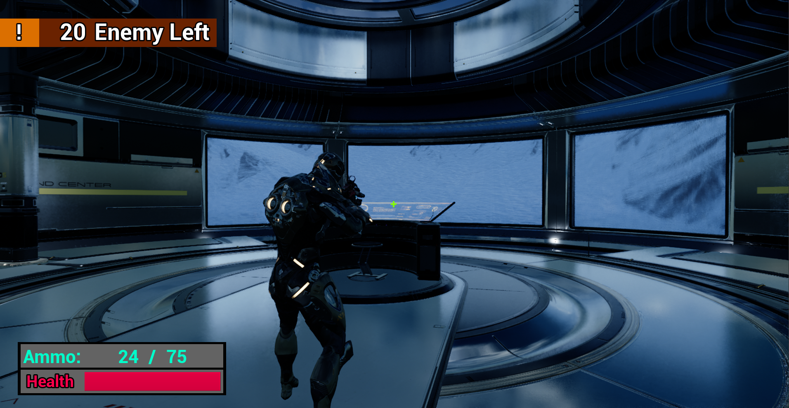
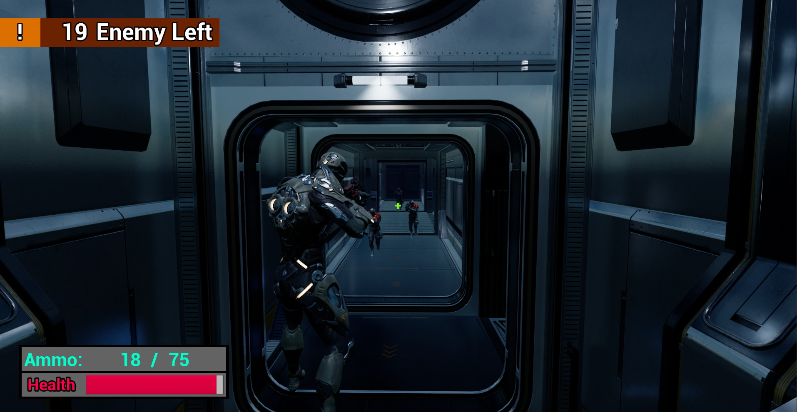

# CodeNameEchoNine

## Unreal Engine 5.1 C++ Project
CodeNameEchoNine is the third person shooter game.

### Story
Story is based on the character who tries to clean hidden research center. The character has to kill all enemies in the facility.

### Features
- A shooter character
- Enemies with AI
- Two different weapon types
- HUD
- Menus
